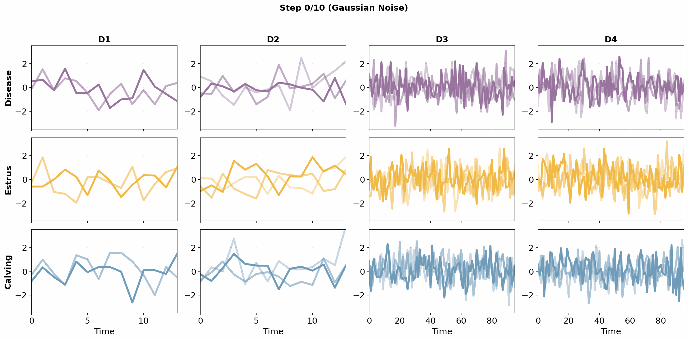

### SynLS: a framework for generating high-quality wearable sensor time series data validated in livestock monitoring

SynLS is a model designed for generating highly realistic livestock wearable sensor data using diffusion architecture and transformer encoder mechanism. 

  

### Project structure
	SynLS/
	├── data/                         # Folder for datasets
	├── model/                        # Folder for source code (modeling)
	│   ├── diffusion.py              # SynLS source code
	│   ├── timevae.py                # TimeVAE model
	│   ├── timegan.py                # TimeGAN model
	│   ├── utils.py                  # Utils to normalize data and create time step
	│   └── zoo.py                    # Base modules for TimeGAN and TimeVAE
	├── eval/                         # Folder for evaluation scripts
	│   ├── fig3c_posthoc.py          # Post-hoc discriminator (real vs synthetic)
	│   ├── fig3d_utility_overall.py  # Overall utility evaluation (3-fold CV x 5 repeats)
	│   └── fig3e_utility_future.py   # Future utility evaluation (chronological split)
	├── preprocess/                   # Folder for data preprocessing
	│   ├── preprocess_D1.py          # Preprocess D1 (Lin et al.)
	│   ├── preprocess_D2.py          # Preprocess D2 (Ranzato et al.)
	│   ├── preprocess_D3.py          # Preprocess D3 (Lardy_1 et al.)
	│   ├── preprocess_D4.py          # Preprocess D4 (Lardy_2 et al.)
	│   ├── preprocess_ito.py         # Preprocess Ito et al. accelerometer data
	│   ├── preprocess_versluijs.py   # Preprocess Versluijs et al. accelerometer data
	│   ├── preprocess_gashi.py       # Preprocess Gashi et al. accelerometer data
	│   └── preprocess_tonkin.py      # Preprocess Tonkin et al. accelerometer data
	├── timediffusion.py              # Main function for SynLS
	├── timegan.py                    # Main function for TimeGAN
	├── timevae.py                    # Main function for TimeVAE
	├── README.md                     # Readme file
	└── requirements.txt              # Dependencies

### Requirements
The code requires

	* Python 3.8 or higher
	* Numpy 1.24.4 or higher
	* Pandas 1.3.4 or higher
	* Keras 2.7.0 or higher
	* Tensorflow 2.7.0 or higher

	# Install all required packages
	pip install -r requirements.txt

 
### Modeling

	python timediffusion.py 
	
	The key hyperparameters for the model are:
	* --path PATH             Path to the data file. Please provide the absolute path
	* --step STEP             Time step for diffusion (default: 10)
	* --epoch EPOCH           The number of training epochs
	* --batch_size BATCH_SIZE Training batch size
	* --new_num NEW_NUM       The number of generating new samples
	* --encoder_type TYPE     Encoder type: time, pairwise, or dual (default: dual)
	* --output OUTPUT         Output file name for generated samples (default: new_samples.npy)

	The output for the model are:
	* cp.ckpt: checkpoint file
	* new_samples.npy: generated new samples in .npy format
